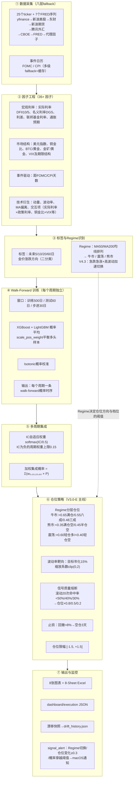

# 金价预测逻辑流程（V4.3.1）

> 本文档是项目的核心知识文件，描述 gold_model 如何从原始数据走到"看多概率 + 仓位建议"。
> 所有规则与参数均对照 `src/gold_model/gold_factor_v4.py` 实际代码整理，改代码时请同步本文档。

## 全流程总览



## 各阶段详解

### ① 数据采集
- 25 个行情 ticker + 7 个 FRED 宏观序列，八层 fallback 逐 ticker 独立降级（详见 `data_fetcher.py` 与 README）。
- 金价、铜价用**新浪 COMEX 真期货价**；美元指数/外汇走腾讯（真 DXY，T+0）；VIX 全家走 CBOE 官方 CSV；利率/BTC 走 FRED。
- 数据时效校验：最新金价日期超过 4 天会打印告警（不中断）。
- 关键清洗：只保留有金价的交易日行（FRED 非交易日行曾导致 Regime 全失效的根因 bug）。

### ② 因子工程（35+ 因子）
四大类：宏观利率（黄金定价的核心矛盾）、市场结构（美元/铜/矿股/波动率）、事件日历（FOMC/CPI 倒计时）、技术衍生与交互项。因子全部围绕"实际利率 + 美元 + 避险情绪"的黄金定价逻辑构建。

### ③ 标签与 Regime
- **标签**：未来 N 日收益 > 0 记 1 否则 0，N ∈ {5, 10, 20, 60}，多周期分别建模。
- **Regime**：MA50 与 MA200 均线排列定牛熊；V4.3 增加快速切换——金价偏离 MA50 超 ±3% 且 20 日涨跌超 ±5%（熊市另要求高波动分位）时立即切换，不等均线慢速跟随。
- Regime 不进入特征，而是决定**仓位层的方向和阈值**（牛市不做空是核心非对称设计）。

### ④ Walk-Forward 训练
- 每个预测周期独立滚动训练：训练 500 日 → 测试 60 日 → 步进 30 日，严格时间顺序，**无未来函数**（测试集用训练集中位数填 NaN、用训练集 scaler）。
- 模型：XGBoost + LightGBM（80 棵树、深度 3、学习率 0.05，强正则），预测概率取平均。
- 类别平衡：牛市样本多（800/176/278），用 `scale_pos_weight`（限幅 2.0）抑制多头偏见。
- 校准：Isotonic Regression 把模型分数校准成真实概率。
- 产出：全历史 walk-forward 概率序列（回测用）+ 准确率/AUC/IC 指标。

### ⑤ 多周期集成
- 四个周期的概率按 **softmax(IC/0.5)** 自适应加权，IC 为负的周期权重压到 0.15 上限后重新归一。
- 近期实测权重约 5日0.18 / 10日0.18 / 20日0.22 / 60日0.42——长周期 IC 更高，自动占主导。

### ⑥ 仓位策略（四道风控串联）
1. **Regime 分层仓位**：概率阈值分档，牛市只多不空、熊市可空、震荡轻仓。
2. **波动率靶向**：目标年化波动 15%，实际波动高则缩仓（系数 0~2 倍）。
3. **信号质量熔断**：滚动 20 次 WF 命中率 <50%/40%/30% 时仓位 ×0.8/×0.5/×0.2——模型退化时自动收缩。
4. **止损**：净值回撤超 8% 强制空仓 3 天。最终仓位限幅 ±1.5。

### ⑦ 输出与监控
- 每日：8 图 + Excel 报告 + 两个 web JSON（前端数据源）+ 漂移快照（90 条滚动）。
- `signal_alert.py`：6 类触发（Regime 切换、仓位变化≥0.3、概率穿越 0.30/0.35/0.65/0.70）+ 4 类信号回测告警（命中率偏低、连续错误≥3 等），launchd 周二~六 22:30 自动跑，有告警弹 macOS 通知。

## 每日当前预测的生成路径

```
全量历史重训4个周期模型（XGB+LGB，无校准）→ 取最新交易日因子行
→ 中位数填充 + 标准化 → 各周期出概率 → IC权重加权（与回测一致）
→ 按当前Regime查表得建议仓位 → 写JSON → signal_alert对比昨日状态决定是否推送
```

## 关键设计决策与已知局限

- **预测对象是未来 N 日方向**（二分类概率），不是点位——概率 0.5 附近意味着"没有观点"，对应空仓。
- **多头偏见是结构性风险**：训练样本牛市占 64%，模型天然偏喊涨；已用类别平衡+熔断缓解，根治需要样本层治理（观察期至 2026-08 中旬）。
- **命中率语义**：命中 = (概率>0.5 的预测方向) == (实际方向)，不是"市场上涨占比"（V4.3.1 修复的语义 bug）。
- **回测与实盘的差异**：回测用 walk-forward 概率（每 30 日一更新），实盘每日用全量重训模型——两者路径不同但权重/阈值一致。
- **数据源切换会扰动特征分布**（如金价从 GLD 代理切到真期货，基差 ~1.4%），漂移监控报"分布偏移"属预期。
